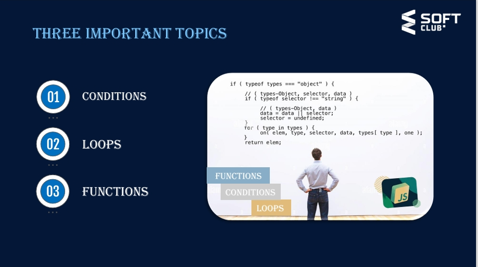

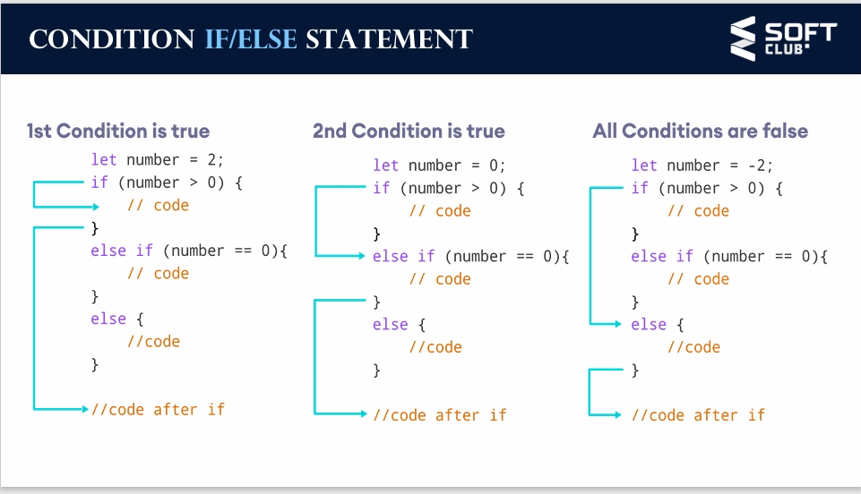

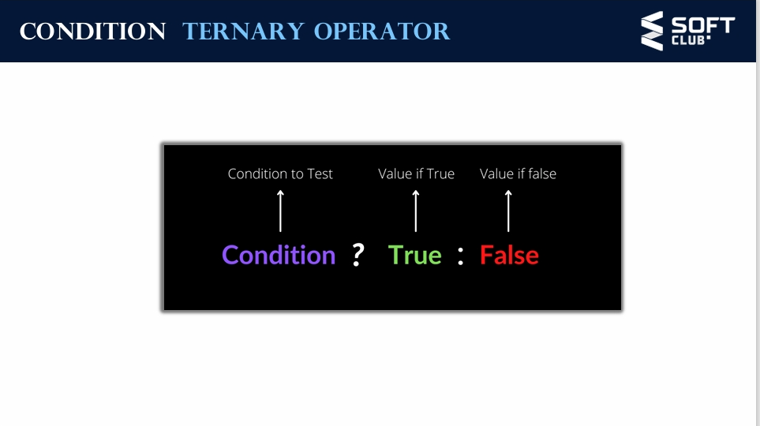
# The switch statement evaluates
 an expression, matching the
 expression's value against a series
 of case clauses, and executes
 statements after the first case
 clause with a matching value, 
until a break statement is
 encountered. The default clause
 of a switch statement will be
 jumpedto if no case matchesthe
 expression's value

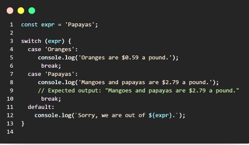
 
 # Loop For
 ### The for statement creates a loop that
 consists of three optional expressions, 
enclosed in parentheses and separated by
 semicolons, followed by a statement
 (usually a block statement) to be
 executed in the loop.
 The following for statement starts by 
declaring the variable i and initializing it 
to 0. It checks that i is less than nine, 
performs the two succeeding statements, 
and increments i by 1 after each pass 
through the loop.

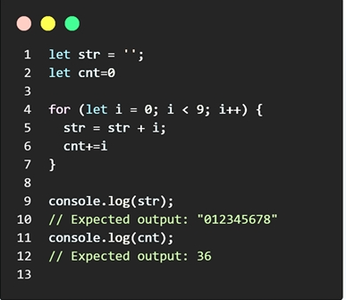

# LOOP while

##The while statement creates a loop that
 executes a specified statement as long as
 the test condition evaluates to true. The 
condition is evaluated before executing the
 statement.
 The following while loop iterates as long as
 n is less than three.
 Note: Use the break statement to stop a 
loop before condition evaluates to true.

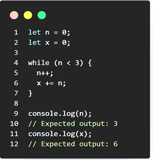

# LOOP Do/while
## The do...while statement creates a loop
 that executes a specified statement until
 the test condition evaluates to false. The 
condition is evaluated after executing
 the statement, resulting in the specified
 statement executing at least once.
 In the following example, the do...while 
loop iterates at least once and reiterates 
until i is no longer less than 5

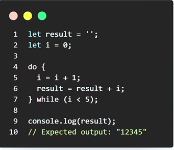

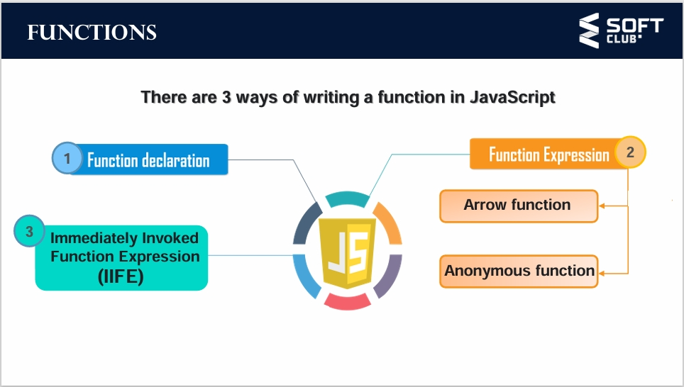

## The function declaration defines a 
function with the specified
 parameters. A function is declared 
using the function keyword.
 The basic rules of naming a function 
are similar to naming a variable. It is 
better to write a descriptive name for 
your function. For example, if a 
function is used to add two numbers, 
you could name the function add or 
addNumbers.

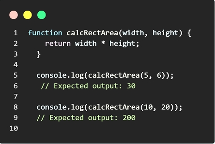

# FUNCTION expression
 A function expression is very
 similar to and has almost the
 samesyntax as a function
 declaration.
 The maindifference between a 
function expression and a 
function declaration is
 the function name, which can be
 omitted in function expressions
 to create anonymous and 
arrow functions

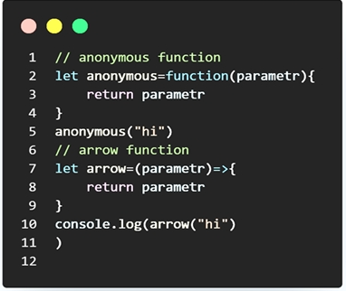

# FUNCTION iife

## An IIFE (Immediately Invoked Function Expression) in JavaScript is a function that runs immediately after it’s defined. It’s a way to create a local scope for variables, preventing them from polluting the global scope1. Here’s the basic structure of an IIFE:

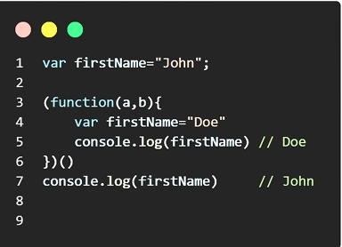

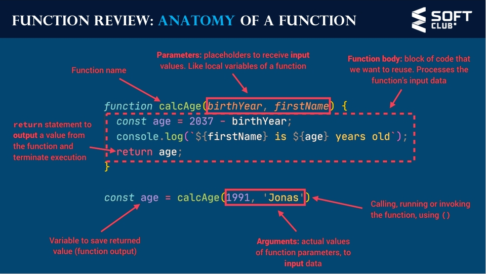